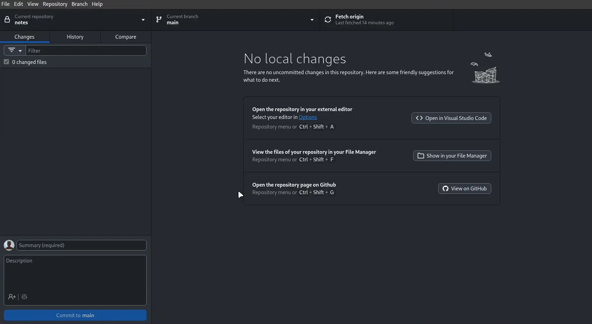
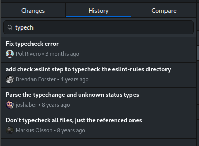
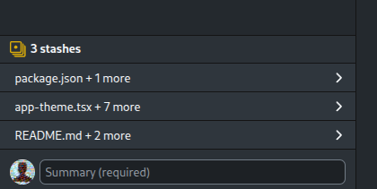
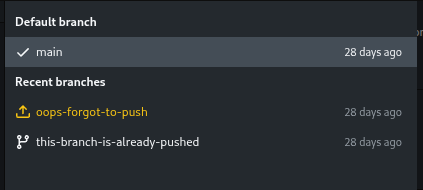
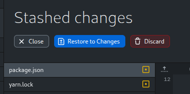
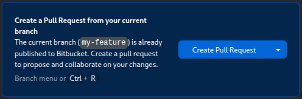
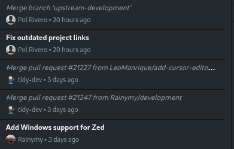

# GitHub Desktop Plus

This is an **up-to-date** fork of [GitHub Desktop](https://desktop.github.com) for Linux with additional features and improvements.



## Highlights
| <h4>Commit history search</h4> | <h4>Multiple stashes per branch</h4> |
| :---: | :---: |
|  |  |
| <h4>Indicator for branches missing in the remote</h4> | <h4>Buttons optimized for visual recognition</h4> |
|  |  |
| <h4>Bitbucket & GitLab integration</h4> | <h4>Indicator for merge commits</h4> |
|  |  |

## Additional Features in GitHub Desktop Plus

### General:

- Red color for destructive action buttons.
- Add **icons** to some similar-looking buttons for faster visual recognition.
- Allow generating **branch name presets** by calling an external script (e.g. fetching ticket numbers from an issue tracker). [Click here for more details](docs/branch-name-presets.md).
- Allow using a **different text editor for a given repo**, by overriding it in the repository settings.
- **Bitbucket** and **GitLab** integration:
  - Preview and create pull requests.
  - View pull requests status, including checks.
  - Display a commit or PR in Bitbucket (web browser).
  - Correctly set repository owner (instead of displaying "Other").

### Repositories list:

- "**Pull all**" button to fetch and pull all your repositories at once.
- Allow **hiding** the "**Recent**" repositories section.

### Branches list:

- Add warning indicator to **local-only branches** (branches that have not been pushed to the remote, or that have been deleted automatically after a PR).
- Allow manually setting which is the **default branch** for a repository (even if it doesn't match the one configured in the remote).

### History tab:

- **Search commits** by title, message, tag, or hash.
- Use a different font style for **merge commits** in order to make them visually distinct, since most of the time they are not as relevant.
- If a commit modifies only 1 file, allow double-clicking the commit to open the file. For other commits, you can still double-click the file as usual.

### Changes tab:

- Context menu option to **permanently discard changes** without sending to trash (useful when the there are many changed files and the regular "Discard" is extremely slow).

## Download and Installation

### Arch Linux / Manjaro (AUR)

<details>
<summary>Click to expand</summary>

Simply install `github-desktop-plus-bin` from the AUR.

You can also build from source by installing `github-desktop-plus` or `github-desktop-plus-git` from the AUR.

> `gnome-keyring` is required and the daemon must be launched either at login or when the X server / Wayland compositor is started. Normally this is handled by a display manager, but in other cases following the instructions found on the [Arch Wiki](https://wiki.archlinux.org/index.php/GNOME/Keyring#Using_the_keyring_outside_GNOME) will fix the issue of not being able to save login credentials.

</details>

### Debian / Ubuntu (APT)

<details>

<summary>Click to expand</summary>

Create the repository file:

```bash
curl https://gpg.polrivero.com/public.key | sudo gpg --dearmor -o /usr/share/keyrings/polrivero.gpg
echo "deb [signed-by=/usr/share/keyrings/polrivero.gpg] https://deb.github-desktop.polrivero.com/ stable main" | sudo tee /etc/apt/sources.list.d/github-desktop-plus.list
```

Update the package list and install:
```bash
sudo apt update
sudo apt install github-desktop-plus
```

</details>


### Fedora / RHEL / CentOS (RPM)

<details>
<summary>Click to expand</summary>

Create the repository file:

```bash
sudo rpm --import https://gpg.polrivero.com/public.key
echo -e "[github-desktop-plus]\nname=GitHub Desktop Plus\nbaseurl=https://rpm.github-desktop.polrivero.com/\nenabled=1\ngpgcheck=1\nrepo_gpgcheck=1\ngpgkey=https://gpg.polrivero.com/public.key" | sudo tee /etc/yum.repos.d/github-desktop-plus.repo
```

Update the package list and install:

```bash
sudo dnf check-update
sudo dnf install github-desktop-plus
```

</details>


### Flatpak (any distro)

<details>
<summary>Click to expand</summary>

You can install GitHub Desktop Plus from Flathub by following the instructions at https://flathub.org/en/apps/io.github.pol_rivero.github-desktop-plus or by running the following command:

```bash
flatpak install flathub io.github.pol_rivero.github-desktop-plus
```

</details>

### AppImage (any distro)

<details>
<summary>Click to expand</summary>

Download the AppImage from the [releases page](https://github.com/pol-rivero/github-desktop-plus/releases/latest) and make it executable:

```bash
chmod +x GitHub-Desktop-Plus-*-linux-*.AppImage
# Just double-click the file to run it
```

| **64-bit x86** | **64-bit ARM** | **32-bit ARM** |
| --- | --- | --- |
| `-linux-x86_64.AppImage` | `-linux-arm64.AppImage` | `-linux-armv7l.AppImage` |

</details>

### Windows

<details>
<summary>Click to expand</summary>

Download and execute the installer from the [releases page](https://github.com/pol-rivero/github-desktop-plus/releases/latest).

| | **64-bit x86** | **64-bit ARM** |
| --- | --- | --- |
| **.EXE Installer** | `-win-x64.exe` | `-win-arm64.exe` |
| **.MSI Installer** | `-win-x64.msi` | `-win-arm64.msi` |

</details>

### macOS

<details>
<summary>Click to expand</summary>

Download the ZIP file from the [releases page](https://github.com/pol-rivero/github-desktop-plus/releases/latest) and extract it. To run the installer, execute the file `GitHub Desktop Plus.app/Contents/MacOS/GitHub Desktop`.

| **64-bit x86** | **64-bit ARM (Apple Silicon)** |
| --- | --- |
| `-macOS-x64.zip` | `-macOS-arm64.zip` |

</details>

## Running the app locally

### From the terminal

```bash
corepack enable  # Install yarn if needed
yarn             # Install dependencies
yarn build:dev   # Initial build
yarn start       # Start the app for development and watch for changes
```

- It's normal for the app to take a while to start up, especially the first time.

- While starting up, this error is normal: `UnhandledPromiseRejectionWarning: Error: Invalid header: Does not start with Cr24`

- You don't need to restart the app to apply changes. Just reload the window (`Ctrl + Alt + R` / `Cmd + Alt + R`).

- Changes to the code inside `main-process` do require a full rebuild. Stop the app and run `yarn build:dev` again.

- [Read this document](docs/contributing/setup.md) for more information on how to set up your development environment.

### From VSCode

The first time you open the project, install the dependencies by running:
```bash
corepack enable
yarn
```

Then, you can simply build and run the app by pressing `F5`.  
Breakpoints should be set in the developer tools, not the VSCode editor.

### Running tests

I recommend running the tests in a Docker container for reproducibility and to avoid conflicts with your git configuration.  
After installing the dependencies with `yarn`, make sure you have Docker installed and run:

```bash
yarn test:docker
```

## Why this fork?

First of all, because shiftkey's fork is currently unmaintained (last commit was in February 2025), so it's not getting the latest features and fixes from the official GitHub Desktop repository.

Secondly, I think the official GitHub Desktop app is very slow in terms of updates and lacks some advanced features that I'd like. This fork has low code quality requirements compared to the official repo, so I (and hopefully you as well) can add features and improvements quickly.  
This fork also focuses on integrating nicely with Bitbucket, since I use it for work and haven't found a good Linux GUI client for it.

Keep in mind that this version is not endorsed by GitHub, and it's aimed at power users with technical knowledge. If you're looking for a polished and stable product, I recommend using the official GitHub Desktop app instead.

---

<details>
<summary>See original README</summary>

# [GitHub Desktop](https://desktop.github.com) - The Linux Fork

[](https://github.com/shiftkey/desktop/actions/workflows/ci.yml)

[GitHub Desktop](https://desktop.github.com/) is an open-source [Electron](https://www.electronjs.org/)-based
GitHub app. It is written in [TypeScript](https://www.typescriptlang.org) and
uses [React](https://reactjs.org/).

<picture>
  <source
    srcset="https://user-images.githubusercontent.com/634063/202742848-63fa1488-6254-49b5-af7c-96a6b50ea8af.png"
    media="(prefers-color-scheme: dark)"
  />
  
</picture>

## What is this repository for?

This repository contains specific patches on top of the upstream
`desktop/desktop` repository to support Linux usage.

It also publishes [releases](https://github.com/shiftkey/desktop/releases) for various Linux distributions:

 - AppImage (`.AppImage`)
 - Debian (`.deb`)
 - RPM (`.rpm`)

## Installation via package manager

You can use your operating system's package manager to install `github-desktop` and
keep it up to date on Debian and RPM-based distributions.

### Debian/Ubuntu

There are two APT package feeds available, both hosted in the US. You only need
to add one or the other here, as both of these are generated based on the
releases from this repository.

#### [@shiftkey](https://github.com/shiftkey) package feed

```sh
wget -qO - https://apt.packages.shiftkey.dev/gpg.key | gpg --dearmor | sudo tee /usr/share/keyrings/shiftkey-packages.gpg > /dev/null
sudo sh -c 'echo "deb [arch=amd64 signed-by=/usr/share/keyrings/shiftkey-packages.gpg] https://apt.packages.shiftkey.dev/ubuntu/ any main" > /etc/apt/sources.list.d/shiftkey-packages.list'
```

#### [@mwt](https://github.com/mwt) package feed

```sh
wget -qO - https://mirror.mwt.me/shiftkey-desktop/gpgkey | gpg --dearmor | sudo tee /usr/share/keyrings/mwt-desktop.gpg > /dev/null
sudo sh -c 'echo "deb [arch=amd64 signed-by=/usr/share/keyrings/mwt-desktop.gpg] https://mirror.mwt.me/shiftkey-desktop/deb/ any main" > /etc/apt/sources.list.d/mwt-desktop.list'
```

#### Installation

Once you have a feed configured, run this command to install the application:

```sh
sudo apt update && sudo apt install github-desktop
```

### Red Hat/CentOS/Fedora

There are two RPM package feeds available, both hosted in the US. You only need
to add one or the other here, as both of these are generated based on the
releases from this repository.

#### [@shiftkey](https://github.com/shiftkey) package feed

```sh
sudo rpm --import https://rpm.packages.shiftkey.dev/gpg.key
sudo sh -c 'echo -e "[shiftkey-packages]\nname=GitHub Desktop\nbaseurl=https://rpm.packages.shiftkey.dev/rpm/\nenabled=1\ngpgcheck=1\nrepo_gpgcheck=1\ngpgkey=https://rpm.packages.shiftkey.dev/gpg.key" > /etc/yum.repos.d/shiftkey-packages.repo'
```

#### [@mwt](https://github.com/mwt) package feed

```sh
sudo rpm --import https://mirror.mwt.me/shiftkey-desktop/gpgkey
sudo sh -c 'echo -e "[mwt-packages]\nname=GitHub Desktop\nbaseurl=https://mirror.mwt.me/shiftkey-desktop/rpm\nenabled=1\ngpgcheck=1\nrepo_gpgcheck=1\ngpgkey=https://mirror.mwt.me/shiftkey-desktop/gpgkey" > /etc/yum.repos.d/mwt-packages.repo'
```

#### Installation

Once you have a feed configured, run this command to install the application:

```sh
# if yum is your package manager
sudo yum install github-desktop

# if dnf is your package manager
sudo dnf install github-desktop

# if zypper is your package manager
sudo zypper ref && sudo zypper in github-desktop
```

#### OpenSUSE

There are two RPM package feeds available, both hosted in the US. You only need
to add one or the other here, as both of these are generated based on the
releases from this repository.

#### [@shiftkey](https://github.com/shiftkey) package feed

```sh
sudo rpm --import https://rpm.packages.shiftkey.dev/gpg.key
sudo sh -c 'echo -e "[shiftkey-packages]\nname=GitHub Desktop\nbaseurl=https://rpm.packages.shiftkey.dev/rpm/\nenabled=1\ngpgcheck=1\nrepo_gpgcheck=1\ngpgkey=https://rpm.packages.shiftkey.dev/gpg.key" > /etc/zypp/repos.d/shiftkey-packages.repo'
```

#### [@mwt](https://github.com/mwt) package feed

```sh
sudo rpm --import https://mirror.mwt.me/shiftkey-desktop/gpgkey
sudo sh -c 'echo -e "[mwt-packages]\nname=GitHub Desktop\nbaseurl=https://mirror.mwt.me/shiftkey-desktop/rpm\nenabled=1\ngpgcheck=1\nrepo_gpgcheck=1\ngpgkey=https://mirror.mwt.me/shiftkey-desktop/gpgkey" > /etc/zypp/repos.d/mwt-packages.repo'
```

#### Installation

```sh
sudo zypper ref && sudo zypper in github-desktop
```


## Other Distributions

### Arch Linux

Arch Linux users can install GitHub Desktop from the [AUR](https://aur.archlinux.org/packages/github-desktop-bin/).

`gnome-keyring` is required and the daemon must be launched either at login or when the X server is started. Normally this is handled by a display manager, but in other cases following the instructions found on the [Arch Wiki](https://wiki.archlinux.org/index.php/GNOME/Keyring#Using_the_keyring_outside_GNOME) will fix the issue of not being able to save login credentials.

### Cross-Distribution Packages

GitHub Desktop is also available cross-platform as a [Flatpak](https://github.com/flathub/io.github.shiftey.Desktop) and [AppImage](https://appimage.github.io/GitHubDesktop/).

### deb-get

Debian/Ubuntu users can also install directly from this repository using [`deb-get`](https://github.com/wimpysworld/deb-get): `deb-get install github-desktop`.

## Known issues

If you're having troubles with Desktop, please refer to the [Known issues](docs/known-issues.md#linux)
document for guidance and workarounds for common limitations.

If your package manager is still trying to reach PackageCloud, refer to the
[cleanup instructions](docs/known-issues.md#the-packagecloud-package-feed-is-no-longer-working)
for details about migrating away.

## More information

Please check out the [README](https://github.com/desktop/desktop#github-desktop)
on the upstream [GitHub Desktop project](https://github.com/desktop/desktop) and
[desktop.github.com](https://desktop.github.com) for more product-oriented
information about GitHub Desktop.

See our [getting started documentation](https://docs.github.com/en/desktop/overview/getting-started-with-github-desktop) for more information on how to set up, authenticate, and configure GitHub Desktop.

## License

**[MIT](LICENSE)**

The MIT license grant is not for GitHub's trademarks, which include the logo
designs. GitHub reserves all trademark and copyright rights in and to all
GitHub trademarks. GitHub's logos include, for instance, the stylized
Invertocat designs that include "logo" in the file title in the following
folder: [logos](app/static/logos).

GitHub® and its stylized versions and the Invertocat mark are GitHub's
Trademarks or registered Trademarks. When using GitHub's logos, be sure to
follow the GitHub [logo guidelines](https://github.com/logos).

</details>
